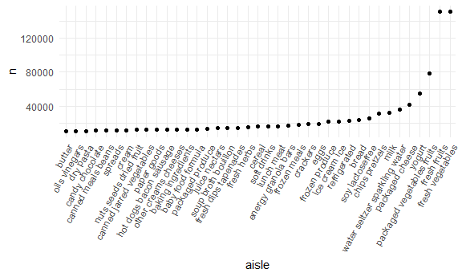
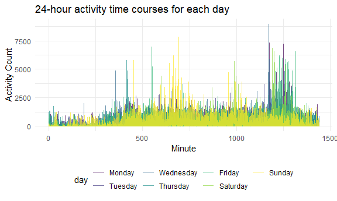
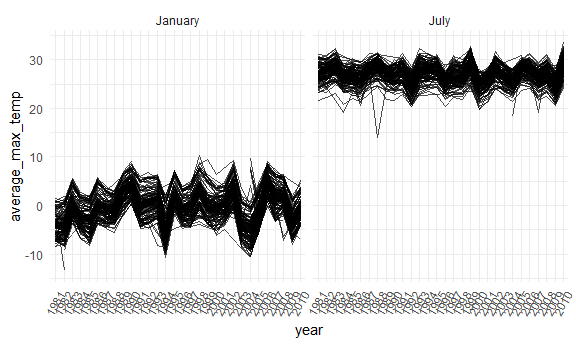
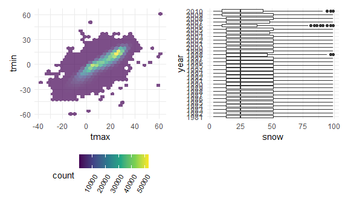

p8105_hw3_yl4924
================
Yongzheng Li
2022-10-15

# Load the package adjust graph display

``` r
library(tidyverse)
library(ggridges)
library(patchwork)
library(p8105.datasets)

knitr::opts_chunk$set(
    echo = TRUE,
    warning = FALSE,
  fig.width = 6,
  fig.asp = .6,
  out.width = "90%"
)

theme_set(theme_minimal() + theme(legend.position = "bottom"))

options(
  ggplot2.continuous.colour = "viridis",
  ggplot2.continuous.fill = "viridis"
)

scale_colour_discrete = scale_colour_viridis_d
scale_fill_discrete = scale_fill_viridis_d
```

# Problem 1

### load the data

``` r
data("instacart")
instacart <- 
  instacart %>% 
  as_tibble(instacart)
```

The dataset contain 1384617 of rows and 15 variables. The variables
include identification variable order_id, product_id, user_id. There are
several item specific variable, describing product name(e.g. yogurt),
department(dairy), and aisle(e.g. fresh vegetables) and wheather their
order has been ordered in the past.

### Part 1

``` r
instacart %>% 
  count(aisle) %>% 
  arrange(desc(n))
```

    ## # A tibble: 134 × 2
    ##    aisle                              n
    ##    <chr>                          <int>
    ##  1 fresh vegetables              150609
    ##  2 fresh fruits                  150473
    ##  3 packaged vegetables fruits     78493
    ##  4 yogurt                         55240
    ##  5 packaged cheese                41699
    ##  6 water seltzer sparkling water  36617
    ##  7 milk                           32644
    ##  8 chips pretzels                 31269
    ##  9 soy lactosefree                26240
    ## 10 bread                          23635
    ## # … with 124 more rows

There are 134 aisle. Fresh vegetables is the most items ordered from.

### Part 2

``` r
instacart %>% 
  count(aisle) %>% 
  filter(n > 10000) %>% 
  arrange(desc(n)) %>% 
  mutate(aisle = fct_reorder(aisle, n)) %>% 
  ggplot(aes(x = aisle, y = n)) +
  geom_point() +
  theme(axis.text.x = element_text(angle = 60, hjust = 1))
```



### Part 3

``` r
instacart %>% 
  filter(aisle %in% c("baking ingredients", "dog food care", "packaged vegetables fruits")) %>% 
  group_by(aisle, product_name) %>% 
  summarize(n_item = n()) %>% 
  mutate(rank = min_rank(desc(n_item))) %>% 
  filter(rank < 4) %>% 
  arrange(desc(n_item)) %>% 
  knitr::kable()
```

    ## `summarise()` has grouped output by 'aisle'. You can override using the
    ## `.groups` argument.

| aisle                      | product_name                                  | n_item | rank |
|:---------------------------|:----------------------------------------------|-------:|-----:|
| packaged vegetables fruits | Organic Baby Spinach                          |   9784 |    1 |
| packaged vegetables fruits | Organic Raspberries                           |   5546 |    2 |
| packaged vegetables fruits | Organic Blueberries                           |   4966 |    3 |
| baking ingredients         | Light Brown Sugar                             |    499 |    1 |
| baking ingredients         | Pure Baking Soda                              |    387 |    2 |
| baking ingredients         | Cane Sugar                                    |    336 |    3 |
| dog food care              | Snack Sticks Chicken & Rice Recipe Dog Treats |     30 |    1 |
| dog food care              | Organix Chicken & Brown Rice Recipe           |     28 |    2 |
| dog food care              | Small Dog Biscuits                            |     26 |    3 |

### Part 4

``` r
instacart %>% 
  filter(product_name %in% c("Pink Lady Apples", "Coffee Ice Cream")) %>% 
  group_by(product_name, order_dow) %>% 
  summarize(mean_hour_of_day = mean(order_hour_of_day)) %>% 
  spread(key = order_dow, value = mean_hour_of_day) %>% 
  knitr::kable(digits = 2)
```

    ## `summarise()` has grouped output by 'product_name'. You can override using the
    ## `.groups` argument.

| product_name     |     0 |     1 |     2 |     3 |     4 |     5 |     6 |
|:-----------------|------:|------:|------:|------:|------:|------:|------:|
| Coffee Ice Cream | 13.77 | 14.32 | 15.38 | 15.32 | 15.22 | 12.26 | 13.83 |
| Pink Lady Apples | 13.44 | 11.36 | 11.70 | 14.25 | 11.55 | 12.78 | 11.94 |

# Problem 2

### Part 1: load, clean and tidy the data

``` r
accel_data <- read_csv(
              "./data/accel_data.csv") %>% 
              janitor::clean_names() %>% 
              pivot_longer(
                starts_with("activity"),
                names_to = "minute",
                names_prefix = "activity_",
                values_to = "activity_count") %>% 
              mutate(
                minute = as.integer(minute),
                type_of_day = case_when(
                  day %in% c("Monday", "Tuesday", "Wednesday", "Thursday", "Friday") ~ 1,
                  day %in% c("Saturday", "Sunday")                                   ~ 2),
                type_of_day = recode_factor(type_of_day, `1` = "weekday", `2` = "weekend"),
                day = factor(day, levels = c("Monday", "Tuesday", "Wednesday", "Thursday", "Friday","Saturday", "Sunday")))
```

    ## Rows: 35 Columns: 1443
    ## ── Column specification ────────────────────────────────────────────────────────
    ## Delimiter: ","
    ## chr    (1): day
    ## dbl (1442): week, day_id, activity.1, activity.2, activity.3, activity.4, ac...
    ## 
    ## ℹ Use `spec()` to retrieve the full column specification for this data.
    ## ℹ Specify the column types or set `show_col_types = FALSE` to quiet this message.

The accel_data contain 50400 number of observations of a 63 year old
male with bmi 25 in 35 days. The dataset contain 6 variables. The
variables include week, day_id, day of week, minute, activity_count, and
type of day. Among these variables, activity_count is the most important
variable. The mean activity_count of the male in 35 days is 267.0440592
per minutes.

### Part 2: total activity over the day

``` r
accel_data %>% 
  group_by(week, day) %>% 
  summarize(total_day_count = sum(activity_count)) %>% 
  pivot_wider(
    names_from = "day",
    values_from = "total_day_count") %>% 
  knitr::kable(digits = 1)
```

    ## `summarise()` has grouped output by 'week'. You can override using the
    ## `.groups` argument.

| week |   Monday |  Tuesday | Wednesday | Thursday |   Friday | Saturday | Sunday |
|-----:|---------:|---------:|----------:|---------:|---------:|---------:|-------:|
|    1 |  78828.1 | 307094.2 |    340115 | 355923.6 | 480542.6 |   376254 | 631105 |
|    2 | 295431.0 | 423245.0 |    440962 | 474048.0 | 568839.0 |   607175 | 422018 |
|    3 | 685910.0 | 381507.0 |    468869 | 371230.0 | 467420.0 |   382928 | 467052 |
|    4 | 409450.0 | 319568.0 |    434460 | 340291.0 | 154049.0 |     1440 | 260617 |
|    5 | 389080.0 | 367824.0 |    445366 | 549658.0 | 620860.0 |     1440 | 138421 |

From the output table, there is a increasing trend of activity count on
weekdays in week 1, week 2, and week 5. Week 4 has a decreasing trend of
activity count on weekdays. It is worth to note that On Saturday in week
4 and 5, the total activity count is 1440 that means there is only 1
activity count per minute in these two days. The value is probably a
missing value and we should give more attention to these values.

### Part 3: single-panel plot that show 24 hour activity time courses

``` r
accel_data %>% 
ggplot(aes(x = minute, y = activity_count, color = day)) +
  geom_line(alpha = 0.7) +
  labs(
    title = "24-hour activity time courses for each day",
    x = "Minute",
    y = "Activity Count"
  )
```



From the plot, minutes from 0 to 250 has relative low activity
count(below 1250 counts). The activity count increased from 250 mins to
1125 mins(around 1875 counts except Sunday). The activity count
increased to the highest from 1125 mins to 1300 mins(above 3000 counts).
The activity count decreased below 1250 counts after 1300 mins(around
1250 counts).

# Problem 3

### load the view “ny_noaa” data

``` r
data("ny_noaa")
ny_noaa <- 
  ny_noaa %>% 
  as_tibble(ny_noaa)
head(ny_noaa)
```

    ## # A tibble: 6 × 7
    ##   id          date        prcp  snow  snwd tmax  tmin 
    ##   <chr>       <date>     <int> <int> <int> <chr> <chr>
    ## 1 US1NYAB0001 2007-11-01    NA    NA    NA <NA>  <NA> 
    ## 2 US1NYAB0001 2007-11-02    NA    NA    NA <NA>  <NA> 
    ## 3 US1NYAB0001 2007-11-03    NA    NA    NA <NA>  <NA> 
    ## 4 US1NYAB0001 2007-11-04    NA    NA    NA <NA>  <NA> 
    ## 5 US1NYAB0001 2007-11-05    NA    NA    NA <NA>  <NA> 
    ## 6 US1NYAB0001 2007-11-06    NA    NA    NA <NA>  <NA>

``` r
skimr::skim(ny_noaa)
```

|                                                  |         |
|:-------------------------------------------------|:--------|
| Name                                             | ny_noaa |
| Number of rows                                   | 2595176 |
| Number of columns                                | 7       |
| \_\_\_\_\_\_\_\_\_\_\_\_\_\_\_\_\_\_\_\_\_\_\_   |         |
| Column type frequency:                           |         |
| character                                        | 3       |
| Date                                             | 1       |
| numeric                                          | 3       |
| \_\_\_\_\_\_\_\_\_\_\_\_\_\_\_\_\_\_\_\_\_\_\_\_ |         |
| Group variables                                  | None    |

Data summary

**Variable type: character**

| skim_variable | n_missing | complete_rate | min | max | empty | n_unique | whitespace |
|:--------------|----------:|--------------:|----:|----:|------:|---------:|-----------:|
| id            |         0 |          1.00 |  11 |  11 |     0 |      747 |          0 |
| tmax          |   1134358 |          0.56 |   1 |   4 |     0 |      532 |          0 |
| tmin          |   1134420 |          0.56 |   1 |   4 |     0 |      548 |          0 |

**Variable type: Date**

| skim_variable | n_missing | complete_rate | min        | max        | median     | n_unique |
|:--------------|----------:|--------------:|:-----------|:-----------|:-----------|---------:|
| date          |         0 |             1 | 1981-01-01 | 2010-12-31 | 1997-01-21 |    10957 |

**Variable type: numeric**

| skim_variable | n_missing | complete_rate |  mean |     sd |  p0 | p25 | p50 | p75 |  p100 | hist  |
|:--------------|----------:|--------------:|------:|-------:|----:|----:|----:|----:|------:|:------|
| prcp          |    145838 |          0.94 | 29.82 |  78.18 |   0 |   0 |   0 |  23 | 22860 | ▇▁▁▁▁ |
| snow          |    381221 |          0.85 |  4.99 |  27.22 | -13 |   0 |   0 |   0 | 10160 | ▇▁▁▁▁ |
| snwd          |    591786 |          0.77 | 37.31 | 113.54 |   0 |   0 |   0 |   0 |  9195 | ▇▁▁▁▁ |

from the the summary result, the data contain 2595176 observations and 9
variables. The key variables are prcp(precipipation in tenth of mm),
snow(snowfall in mm), snwd(snow depth in mm), tmax(temperate max in
tenth degree C), and tmin(temperate min in tenth degree C). Each row
represent a region at a given date with weahter condition. There are
145838, 381221, and 591786 missing values in variable prcp, snow and
snwd that account 5.6%, 14.7%, 22.8% percent of values in each variable,
respectively. There are also missing values in variables tmax and tmin.

### bullet point 1: data cleaning

Clean date by seperating date into year, month, day, change prcp unit to
mm, convert tmax, tmin into numerical variable and change unit to
degrees C.

``` r
ny_noaa <- ny_noaa %>% 
  separate(date, into = c("year", "month", "day"), "-") %>% 
  mutate(
    tmax = as.numeric(tmax)*0.1,
    tmin = as.numeric(tmin)*0.1,
    prcp = prcp*0.1,
    month = month.name[as.integer(month)]
  )

ny_noaa %>% 
  count(snow) %>% 
  arrange(desc(n))
```

    ## # A tibble: 282 × 2
    ##     snow       n
    ##    <int>   <int>
    ##  1     0 2008508
    ##  2    NA  381221
    ##  3    25   31022
    ##  4    13   23095
    ##  5    51   18274
    ##  6    76   10173
    ##  7     8    9962
    ##  8     5    9748
    ##  9    38    9197
    ## 10     3    8790
    ## # … with 272 more rows

The most commonly observed values for snowfall(variable snow) is 0 mm.
The reason that 0 mm snowfall is the most observed value is because snow
only falls when temperate is very low(around 0 degree c). In every year,
only some of the countries can have snowfalls during the winter.
Therefore, it is usual to see the most observed value of snowfall = 0.

### bullet point 2:

``` r
ny_noaa %>% 
  filter(month %in% c("January", "July")) %>% 
  group_by(id, month, year) %>% 
  summarize(average_max_temp = mean(tmax, na.rm = TRUE)) %>% 
  ggplot(aes(x = year, y = average_max_temp, group = id)) +
  geom_line(alpha = 0.7) +
  facet_grid(. ~ month) + 
  theme(axis.text.x = element_text(angle = 60, hjust = 1))
```

    ## `summarise()` has grouped output by 'id', 'month'. You can override using the
    ## `.groups` argument.



From the plot, it is clear to see that average maximum temperature in
July is greater than January. The average maximum temperate fluctuate
across years. The plot shows the pattern that the average maximum
temperate increase for 2-3 years follow by a decrease for 2-3 years.
There are some outliers for both month. One of the outliers has an
average maximum temperate of -13 degrees of C in January in 1982.

### bullet point 3:

since the plot of tmax vs tmin for the full dataset has large number of
data, I choose to use hex plot to plot tmax vs tmin. for plot 2, boxplot
is helpful to show the distribution for different variables.

``` r
tmax_tmin_plot <- 
  ny_noaa %>% 
  ggplot(aes(x = tmax, y = tmin)) + 
  geom_hex(alpha = 0.7) +
  theme(legend.text = element_text(angle = 60, hjust = 1))

dist_snow_plot <-
  ny_noaa %>% 
  filter(0 < snow & snow < 100) %>% 
  ggplot(aes(x = snow, y = year)) +
  geom_boxplot()

tmax_tmin_plot + dist_snow_plot
```



tmax and tmin shows a positive correlation for the full dataset. the
highest count is around tmin = 0 degree C with tmax = 10 degree C and
tmin = 15 degree C with tmax = 25 degree C. From the dist_snow_plot,
each year has similar distribution except years in 2010, 2009, 2006,
2004, and 1998. The box plot shows outliers of snowfall in year 2010,
2006, 1998.
